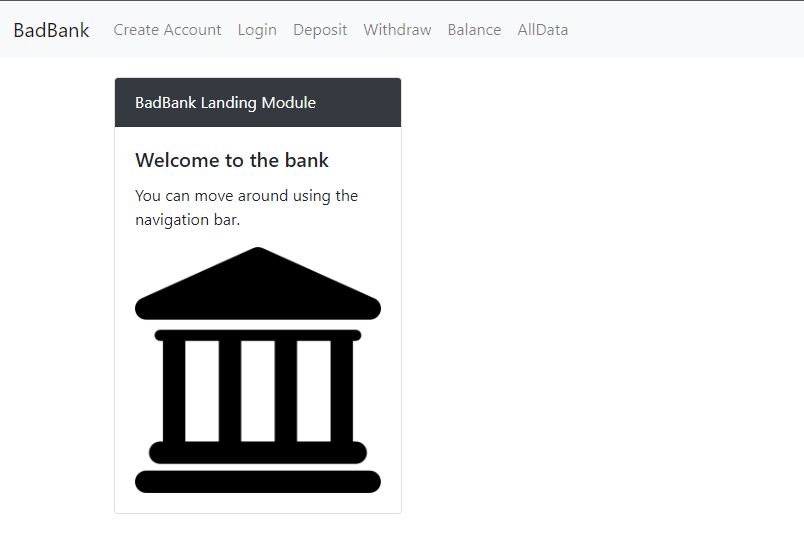

# Banking Application

## Description 
This is a simple Banking Application without security using react to create and manage global state.

## Purpose 
This was done as an assignment in the MIT course - Full Stack Development with Mern

---------

## Technologies Used 
- HTML
- CSS
- Javascript

---------

## Installation 
- Clone this repository to your local machine
- Open a command line on your computer and run the command cd path-to-project-root (this should be the actual directory where the repository is located on your local machine)
- Within the same command-line window, run npm install http-server which will allow you to fire up a web server to access the paage
- Once the command completes successfully, run http-server -c-1
- Open your browser of choice and browse to http://127.0.0.1:8080/

## How to Run 
- When the page is loaded in your browser, you will notice the Home/Welcome Page
- You can click on the following nav items without login -> BadBank , Create Account, All Data
- If you click on the following nav items without being logged in, you will be redirected to the login page -> Deposit, Withdraw, Balance
- Upon successful login, you will be redirected to Balance
---------

## Files 
- **/alldata.js** - Contains the React code to show the data stored in Global State
- **/balance.js** - Contains the React code to show the balance for the logged in user
- **/bank.png** - Image/Logo of a bank
- **/context.js** - Contains the main React code to show the various pages as well as the code to standardize the layout, and to handle validation
- **/createaccount.js** - Contains the React code to show the form to Create a new Account
- **/deposit.js** - Contains the React code to allow the logged in user to deposit into their account
- **/home.js** - Contains the React code to show the home/welcome page
- **/index.html** - Start-up file to be opened by browser
- **/index.js** - Contains the routing and UserContext Global state
- **/login.js** - Contains the React code to show the login form
- **/navbar.js** - Contains the React code to create the navbar with proper routes
- **/users.json** - Contains the starting data (list of users/accounts)
- **/withdraw.js** - Contains the React code to allow the logged in user to withdraw from their account

---------

## Improvements Made
- 2022-04-24: Added forms for Login, Withdraw, and Deposit
- 2022-04-24: Added enhaced error validataion
- 2022-04-24: Refactored to have brunt of logic in Context.js and not in individual pages

## Roadmap of Future Improvements

---------

## Contributing 
Pull requests are welcome. For major changes, please open an issue first to discuss what you would like to change.

## License
[The MIT License (MIT)](https://github.com/slumpbuster/Formik/blob/main/LICENSE)