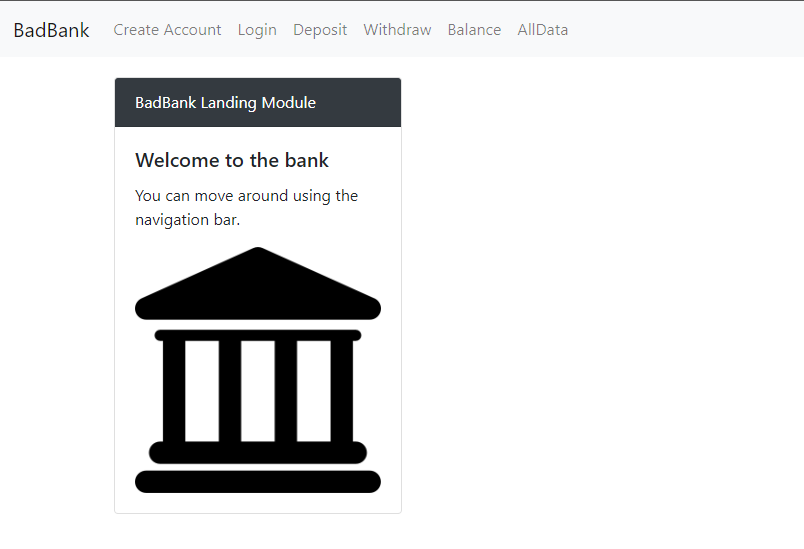

# Banking Application

## Description 
There are two Applications in this Repo:
Complex Banking Application with security/auth using react and connecting to a Mongo DB to create and manage data. Includes Jest and Puppeteer Testing and Swagger API documentation.

## Purpose 
This was done as an assignment in the MIT course - Full Stack Development with Mern
It shows a full three tier application with authentication

---------

## Technologies Used 
- HTML
- CSS
- Javascript
- React
- Node.js
- Express.js
- MongoDb
- Firebase
- Jest
- Puppeteer
- Swagger

---------

## Installation 
- Clone this repository to your local machine by clicking on the Green Code button, followed by selecting Open with GitHub Desktop
- If GtHub Desktop isn't installed you will be prompted to download and then install, if installed GitHub Desktop will open with an option to Clone a Repository. Click the Clone button.
- Open a command line on your computer and run the command cd path-to-project-root (this should be the actual directory where the repository is located on your local machine)
- Within the same command-line window, run npm install which will install the necessary dependencies
- Need to have a firebase account and setup both Auth and Storage and add config info in .env
- Once the command completes successfully, run npm run start
- Open your browser of choice and browse to http://127.0.0.1:3000/
- Alternatively you can right click on the docker-compose.yml file and choose compose up (Make sure Docker is installed and running)

## How to Run 
- When the page is loaded in your browser, you will notice the Home/Welcome Page
- You can click on the following nav items without login -> BadBank , Create Account, All Data
- If you click on the following nav items without being logged in, you will be redirected to the login page -> Deposit, Withdraw, Balance
- Upon successful login, you will be redirected to Balance
---------

## Files
  - **/api/dal.js** - Contains the connection, retrieval, and manipulation of data to Mongo
  - **/index.js** - Contains the apis from the client front end for CRUD
  - **/.env - not in repo, needs created (Variables Needed: MONGO_URL, ALGORITHM, SECRETKEY, EXPIRES, APIKEY, AUTHDOMAIN, PROJECTID, STORAGEBUCKET, MESSAGINGSENDERID, APPID, MEASUREMENTID, PORT)
  - **/public/assets/css/styles.css** - Stylesheet file that positions objects, controls text, colors, and layout
  - **/public/assets/images/background.png** - Background image of all pages
  - **/public/assets/images/bank.png** - Image/Logo of a bank
  - **/public/assets/images/Eoor.jpg** - Error image
  - **/public/assets/images/Loading.png** - Loading Image
  - **/public/assets/js/logic.js** - Contains most of the logi for login and validation
  - **/public/components/alldata.js** - Contains the React code to show the logged in users transactions or if admin, all users information
  - **/public/components/context.js** - Contains the main React code to show the various pages as well as the code to standardize the layout including javascript defined styles
  - **/public/components/createaccount.js** - Contains the React code to show the form to Create a new Account
  - **/public/components/home.js** - Contains the React code to show the home/welcome page
  - **/public/components/login.js** - Contains the React code to show the login form
  - **/public/components/navbar.js** - Contains the React code to create the navbar with proper routes
  - **/public/components/transaction.js** - Contains the React code to allow the logged in user to deposit and/or withdraw from their account
  - **/public/favicon.ico** - Icon to be used if saved as a Favorite/Bookmark
  - **/public/index.html** - Start-up file to be opened by browser
  - **/public/index.js** - Contains the routing
  - **/schema/UserSchema.js** - Mongo Atlas Schema
  - **/swagger/swagger.json** - Swagger API Documentation and Tests
  - **/tests/jest.js** - Jest test to add a new user
  - **/tests/puppetter.js** - Puppetter test to simulate login
  - **/docker-compose.yml** - Yml file to create docker
  - **/Dockefile** - Docker Image creation file
  - **/index.js** - Contains the apis from the client front end for CRUD
  - **/index.test.js** - Test start file
  - **/.env - not in repo, needs created (Variables Needed: MONGO_URL, ALGORITHM, SECRETKEY, EXPIRES, APIKEY, AUTHDOMAIN, PROJECTID, STORAGEBUCKET, MESSAGINGSENDERID, APPID, MEASUREMENTID, PORT)
  - **/MERN-Banking.png** - App Diagram

---------

## Improvements Made
- 2022-04-24: Added forms for Login, Withdraw, and Deposit
- 2022-04-24: Added enhaced error validataion
- 2022-04-24: Refactored to have brunt of logic in Context.js and not in individual pages
- 2022-04-25: Added autofocus on forms
- 2022-04-26: Refactor / streamlined dorm creation using map
- 2022-04-26: Added enhanced error display
- 2022-04-26: Added password check for length of 8
- 2022-04-26: Form submission button disabled until all inputs filled in
- 2022-04-26: Added table for All Data
- 2022-04-26: Added Navigation bold & underline for selected item and tooltip
- 2022-04-26: Fixed Navigation Issues
- 2022-04-27: Fixed Navigation Toggle Button Show/Collapse Issue
- 2022-04-27: Added Transaction History
- 2022-04-27: Moved logic and Javascript stlying to their own files
- 2022-04-27: Added check for existing email
- 2022-07-19: Standalone -> Added connection to MongoDB
- 2022-07-19: Standalone -> Removed local datastore (json file)
- 2022-07-19: Standalone -> Moved some calls over to access Mongo
- 2022-07-29: Standalone -> Incorporated Firebase for Authentication and Storage
- 2022-07-29: Standalone -> Added ability to upload check image and view
- 2022-07-29: Standalone -> Added employee role with ability to see all users and mark user active/disabled
- 2022-07-29: Standalone -> Incorporated JWT for user/role authentication when inserting/updating
- 2022-07-29: Standalone -> Refactored
- 2022-08-03: Standalone -> Added User Accounts (Checking & Saving)
- 2022-08-04: Standalone -> Added Ability to Transfer Funds between accounts
- 2022-08-06: Standalone -> Added Jest & Puppeteer
- 2022-08-14: Standalone -> Added Swagger

## Roadmap of Future Improvements
- Rewrite using Next & GraphQL

---------

## Contributing 
Pull requests are welcome. For major changes, please open an issue first to discuss what you would like to change.

## License
[The MIT License (MIT)](https://github.com/slumpbuster/Formik/blob/main/LICENSE)
